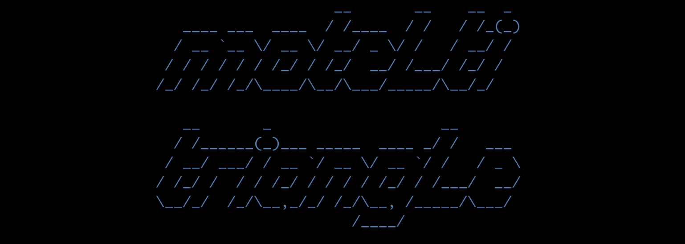
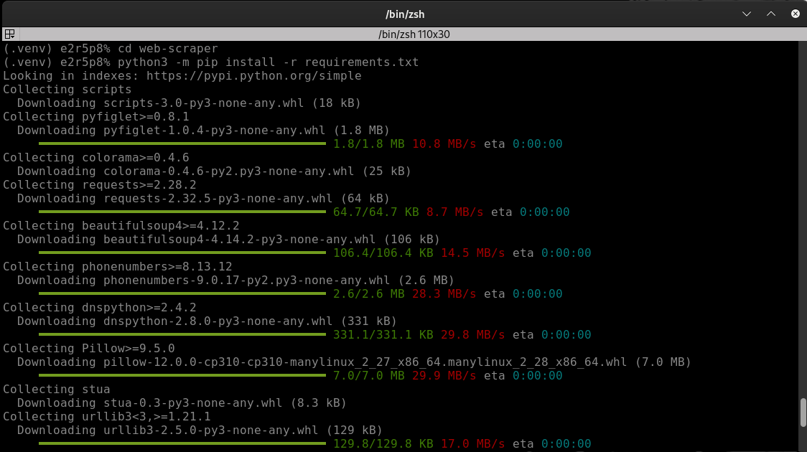

# Triangle Web Scraper



[](https://www.python.org/downloads/)

A lightweight, modular, and terminal-first Python web scraper for extracting links, phone numbers, emails (with optional MX verification), and addresses from web pages. Features a clean CLI interface, a startup ASCII banner, and graceful handling of Ctrl+C for quiet exits.

## Features

- **Modular Design**: Extractors for links, phone numbers, emails, and addresses are organized in separate modules under `extractors/`.
- **CLI-Friendly**: Supports both interactive and non-interactive modes for flexible usage.
- **Graceful Exit**: Exits cleanly with code 0 on Ctrl+C.
- **Optional MX Verification**: Email extraction includes optional domain MX record checks (requires `dnspython`).
- **Responsive**: Uses `requests` with timeouts to handle network issues gracefully.
- **Customizable**: Easily extendable with new extractors and configurable settings.

## Requirements

The project includes a `requirements.txt` file with all necessary dependencies:

- `pyfiglet>=0.8.1` — For ASCII banner generation.
- `colorama>=0.4.6` — For colored terminal output.
- `requests>=2.28.2` — For HTTP requests.
- `beautifulsoup4>=4.12.2` — For HTML parsing.
- `phonenumbers>=8.13.12` — For phone number extraction and validation.
- `dnspython>=2.4.2` *(optional)* — For MX record verification during email extraction.
- `Pillow>=9.5.0` *(optional)* — For image processing features (if implemented).

**Notes**:
- `dnspython` is only required for email MX verification.
- `Pillow` is only needed for image-related features (not used in core scraping).

## Installation

### 1. Install System Packages (Debian/Ubuntu)

Ensure Python 3 and `pip` are installed (administrator privileges may be required):

```bash
sudo apt update
sudo apt install -y python3 python3-pip
```

For other operating systems (e.g., macOS, Windows, or other Linux distributions), install the equivalent Python 3 and `pip` packages using your package manager or the [official Python website](https://www.python.org/downloads/).

### 2. Set Up a Virtual Environment (Recommended)

To avoid conflicts with system Python packages, use a virtual environment:

```bash
python3 -m venv .venv
source .venv/bin/activate  # On Windows: .venv\Scripts\activate
python3 -m pip install -r requirements.txt
```



### 3. Install Python Dependencies

From the project root, install the required packages:

```bash
python3 -m pip install -r requirements.txt
```

To update or regenerate `requirements.txt` after adding new dependencies:
- Install new packages in your virtual environment and run:
  ```bash
  python3 -m pip freeze > requirements.txt
  ```
  This pins exact versions for reproducibility.
- Alternatively, use `pipreqs` to generate a requirements file based on imports:
  ```bash
  python3 -m pip install pipreqs
  pipreqs --force .
  ```

## Usage

Run the scraper in either **interactive** or **non-interactive** mode.


### Interactive Mode

Launch the script and follow the prompts to enter a URL and select an extraction option:

```bash
python3 webscraper.py
```

### Non-Interactive Mode

Provide the URL via stdin and specify an extraction option (1–4):

```bash
echo "https://example.com" | python3 webscraper.py --choice 1
```

**Extraction Options**:
1. **Links**: Extracts all hyperlinks (optionally checks reachability).
2. **Phone Numbers**: Extracts and validates phone numbers using `phonenumbers`.
3. **Emails**: Extracts email addresses with optional MX record verification (if `dnspython` is installed).
4. **Locations**: Extracts addresses using OpenStreetMap Nominatim API.

### Early Termination

Press `Ctrl+C` at any time to exit the program cleanly (exit code 0).

### Examples

- Extract links non-interactively:
  ```bash
  echo "https://example.com" | python3 webscraper.py --choice 1
  ```

- Extract emails with MX verification:
  ```bash
  echo "https://example.com" | python3 webscraper.py --choice 3
  ```

- Run interactively and follow prompts:
  ```bash
  python3 webscraper.py
  ```

## Behavior & Troubleshooting

- **Missing Dependencies**: If you encounter an `ImportError`, ensure all packages in `requirements.txt` are installed using the same Python interpreter running the script.
- **Network Issues**: The scraper uses timeouts in `requests` to prevent hanging. Network errors are logged but won’t crash the program.
- **MX Verification**: If `dnspython` is not installed, email extraction will skip MX checks and note that verification is unavailable.
- **Disable ASCII Banner**: To remove the startup banner, comment out the `pyfiglet` import and call in `webscraper.py` or edit `triangle.py`.
- **Logs**: Check terminal output for detailed error messages or debugging information.

## Contributing

Contributions are welcome! To contribute:

1. **Add New Extractors**: Place new extractor modules under `extractors/` and update `requirements.txt` with any new dependencies.
2. **Update Dependencies**: Use pinned versions (`pip freeze > requirements.txt`) for reproducible CI builds or `pipreqs` for minimal requirements.
3. **Submit Pull Requests**: Fork the repository, create a feature branch, and submit a pull request with clear descriptions of your changes.
4. **Report Issues**: Use the issue tracker to report bugs or suggest improvements.

---
Happy scraping with Triangle Web Scraper!
